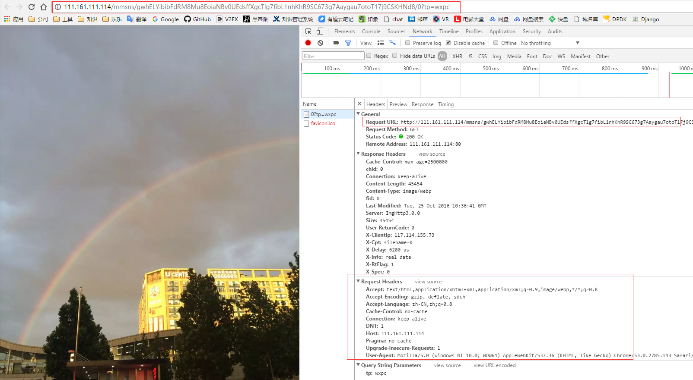

# 微信朋友圈图片的服务策略

​	在web缓存运营中要对微信朋友圈进行加速缓存，经抓包分析发现：1；微信朋友圈中的图片不都存在于同一类服务器中；2、微信朋友圈实现方式为基于webkit的应用框架。根据图片的来源，可以分为三类：

1. 本地图片

   即用户自己上传（发表朋友圈）的图片。该类图片会被直接存放在一个以IP地址标识的服务器上。推测，该IP所在的服务器为离用户最近的服务器；再推测，该服务器的IP地址由微信HTTPDNS服务获取。

   例：http://111.161.111.114/mmsns/gwhELYibibFdRM8Mu8EoiaNBv0UEdsffXgcTlg7fibL1nhKhR9SC673g7Aaygau7otoT17j9CSKHNd8/0?tp=wxpc

   如图：可以看出，该图片请求不包含cookie，可以缓存

   

2. 公众号图片

   即微信公众号中发表的图片。该类图片存放在一组以域名标识的服务器上，该组服务器应根据某种规则（如内容类型）进行分配。

   例：http://mmbiz.qpic.cn/mmbiz_jpg/uggPXkDSooqnFjaez8Yu8FCyJTsXZXQMeI9UFOfEIFj4ZO2JkQGqaiatdXZejxxicyX8I7Du4nE5UiceEia6k3kzXQ/640?wx_fmt=jpeg&tp=webp&wxfrom=5&wx_lazy=1

   如图：可以看出，该图片请求也不包含cookie，可以缓存

   

   实验室测试：

   

3. 外链图片

   即图片不在微信服务器上，完全外链进去的图片（也有可能是公众号，因微信公众号分类较多不在此详述）。该类图片无规律，为普通web服务器，且质量混杂。有大型企业的服务入口、广告，一般内容分离比较完善；也有一些小企业的推广号，基本就是一台服务器全都管了，且访问量有限，地域局限。

   如：京东商城、微信投票

## 服务策略：

1. 针对IP+资源的策略

   该类资源只能使用http请求劫持302的方式进行服务。

2. 针对域名+资源的策略

   该类资源可以使用DNS劫持、http请求302。

3. 针对外链

   不针对性服务。

